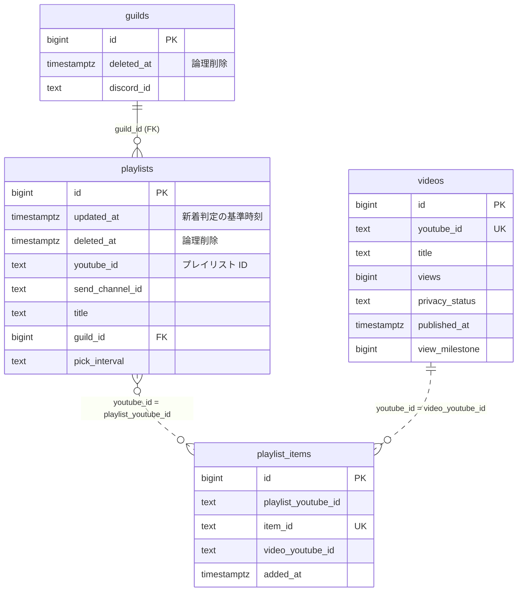
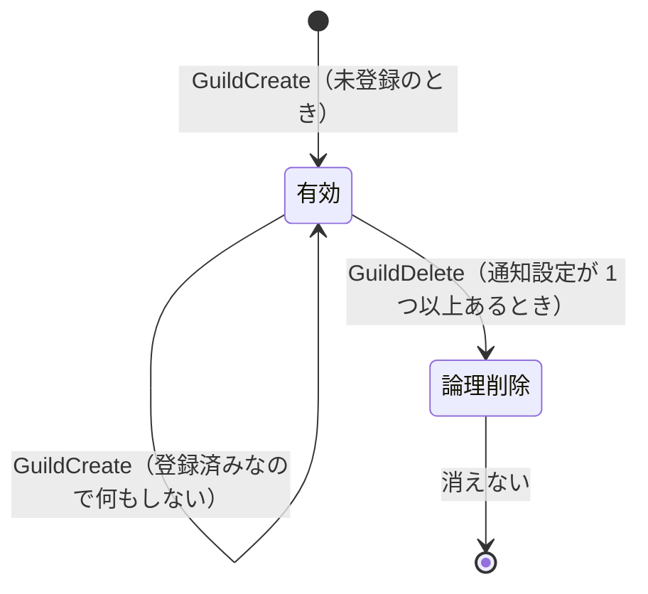
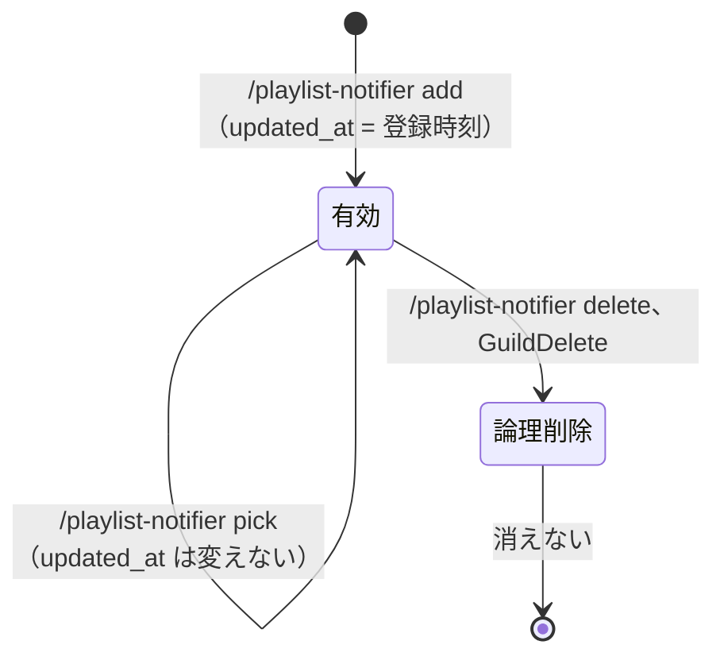
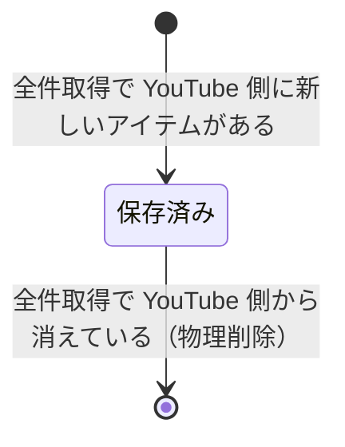
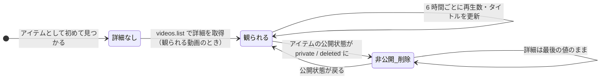

# Discord Playlist Notifier

YouTubeのプレイリストを監視し、新しい動画が追加されるとDiscordチャンネルに通知を送信するDiscordボットです。

## 機能

- 5分ごとにYouTubeプレイリストを自動的にチェックして新しい動画を検出
- 新しい動画が検出されると、設定されたDiscordチャンネルに通知を送信
- Discordのスラッシュコマンドによる簡単な設定
- 複数のプレイリストとチャンネルをサポート
- Dockerによる簡単なデプロイ
- PostgreSQLによる永続的なデータストレージ

## 必要条件

- [Docker](https://www.docker.com/)と[Docker Compose](https://docs.docker.com/compose/)
- DiscordボットトークンDeveloper Portal](https://discord.com/developers/applications)から取得)
- YouTube API キー([Google Cloud Console](https://console.cloud.google.com/)から取得)

## インストール

1. リポジトリをクローンします:
   ```bash
   git clone https://github.com/tabo-syu/discord-playlist-notifier.git
   ```

2. プロジェクトディレクトリに移動します:
   ```bash
   cd discord-playlist-notifier
   ```

3. 環境設定ファイルをコピーして設定します:
   ```bash
   cp .env.example .env
   ```

4. `.env`ファイルを編集して設定を行います:
   ```
   # DB設定
   DB_HOST=db
   DB_TIMEZONE=Asia/Tokyo  # またはお好みのタイムゾーン
   DB_PORT=5432
   DB_NAME=your_db_name
   DB_USER=your_db_user
   DB_PASSWORD=your_db_password
   
   # APIキー
   YOUTUBE_APIKEY=your_youtube_api_key
   DISCORD_ACCESS_TOKEN=your_discord_bot_token
   ```

5. Docker Composeでアプリケーションを起動します:
   ```bash
   docker compose up -d
   ```

6. [Discord Developer Portal](https://discord.com/developers/applications)のOAuth2 URL生成ツールを使用して、ボットをDiscordサーバーに招待します。
   - 必要な権限: `bot`と`applications.commands`
   - 必要なボット権限: `Send Messages`, `Embed Links`, `Use Slash Commands`

## 設定

### 環境変数

| 変数 | 説明 | デフォルト値 |
|----------|-------------|---------|
| DB_HOST | PostgreSQLホスト | db |
| DB_TIMEZONE | データベースタイムゾーン | Asia/Tokyo |
| DB_PORT | PostgreSQLポート | 5432 |
| DB_NAME | PostgreSQLデータベース名 | - |
| DB_USER | PostgreSQLユーザー名 | - |
| DB_PASSWORD | PostgreSQLパスワード | - |
| YOUTUBE_APIKEY | YouTube Data API v3キー | - |
| DISCORD_ACCESS_TOKEN | Discordボットトークン | - |

## 使用方法

ボットが起動してサーバーに招待されたら、以下のスラッシュコマンドを使用してプレイリスト通知を設定できます。

### スラッシュコマンド

#### `/playlist-notifier list`

サーバーで現在監視されているプレイリストの一覧を表示します。

#### `/playlist-notifier add [playlist-id]`

監視するYouTubeプレイリストを追加します。このプレイリストの通知は、このコマンドが実行されたチャンネルに送信されます。

**パラメータ:**
- `playlist-id`: YouTubeプレイリストID。YouTubeプレイリストURLの`list=`の後の部分です。

**例:**
プレイリストURL `https://www.youtube.com/playlist?list=PLexample123` の場合、プレイリストIDは `PLexample123` です。

#### `/playlist-notifier delete [playlist-id]`

監視中のYouTubeプレイリストを削除します。

**パラメータ:**
- `playlist-id`: 監視を停止するYouTubeプレイリストID。

#### `/playlist-notifier source`

ボットのGitHubリポジトリへのリンクを表示します。

## 動作の仕組み

1. ボットは5分ごとに登録されたすべてのYouTubeプレイリストをチェックします。
2. 新しい動画が検出されると、ボットは設定されたDiscordチャンネルに通知メッセージを送信します。
3. ボットは既に通知した動画を追跡して、重複通知を避けます。

## データのライフサイクル

DB の各テーブルの行が、いつ作られ、いつ更新され、いつ消えるかをまとめます。
コードの構成は `CLAUDE.md` を参照してください。

### 全体像

テーブルは役割で 2 つに分かれます。

- **サーバーごとの設定**（`guilds`、`playlists`）: Discord のイベントとスラッシュコマンドで変わる
- **プレイリストの中身**（`playlist_items`、`videos`）: YouTube から取ってきたもの。全サーバーで共有し、定期実行で変わる



実線は外部キー、点線は YouTube の ID で結び付けている関係（外部キーなし）です。
`playlists` テーブルは、コード上は `subscription.Subscription`（サーバーごとの通知設定）です。

#### 誰がいつ書き込むか

| きっかけ | 間隔 | `guilds` | `playlists` | `playlist_items` | `videos` |
|---|---|---|---|---|---|
| ボットがサーバーに参加・再接続（`GuildCreate`） | イベント | 作成 | | | |
| ボットがサーバーから外れる（`GuildDelete`） | イベント | 論理削除 | 論理削除 | | |
| `/playlist-notifier add` | コマンド | | 作成 | | |
| `/playlist-notifier delete` | コマンド | | 論理削除 | | |
| `/playlist-notifier pick` | コマンド | | `pick_interval` を更新 | | |
| `NotifyUpdates`（新着の通知） | 5 分 | | `updated_at`・`title` を更新 | 追加・物理削除 | 作成・公開状態と詳細を更新 |
| `RefreshVideos`（再生数の更新） | 6 時間 | | | | 詳細・節目を更新 |
| `PostPicks` / `PostWrapped` | 毎日 / 年末 | | | | （読むだけ） |

物理削除するのは `playlist_items` だけです。`guilds` と `playlists` は論理削除（`deleted_at`）、`videos` は削除しません。

### `guilds` — ボットが参加しているサーバー



- **作成**: `GuildCreate` のたびに、未登録なら 1 行作ります。`GuildCreate` は再接続のたびに届くので、ほとんどは「登録済み」で終わります。
- **削除**: `GuildDelete` で、そのサーバーの通知設定と一緒に論理削除します。
  - そのサーバーに通知設定が 1 つもないと、途中で return して**削除されません**（既知の挙動）。
- **再参加**: 論理削除された行は「未登録」とみなすので、新しい行が作られます。古い行は残り続けます。

### `playlists` — サーバーごとの通知設定



- **作成**: `add` で、YouTube でプレイリストの存在とタイトルを確かめてから作ります。同じサーバーに同じプレイリストは 1 つだけです。
- **`updated_at` は新着判定の基準時刻**です。プレイリストへの追加時刻（`playlist_items.added_at`）がこれ以降のアイテムを新着とみなします。
  - 登録した時点が基準になるので、**登録前からあった動画は通知しません**。
  - 新着を通知するとき、Discord に送る**前に**現在時刻へ進めます。送信に失敗すると通知は失われますが、二重には送りません。
  - `pick_interval` の変更は `UpdateColumn` で行い、`updated_at` を動かしません。
  - 手で過去に戻すと、その時刻以降の動画を再通知できます。
- **削除**: 論理削除です。プレイリストの中身（`playlist_items`、`videos`）は他のサーバーと共有しているので消しません。

### `playlist_items` — プレイリストの各アイテム



- 5 分ごとの `NotifyUpdates` が、どこかのサーバーが登録しているプレイリストを同期します（`LibraryService.Sync`）。
- **全件取得**は、次のどちらかのときだけ行います。それ以外は保存済みのアイテムをそのまま使います。
  - YouTube 上のアイテム数が前回と変わった
  - 前回の全件取得から 1 時間（`FULL_SYNC_INTERVAL`）経った
- 全件取得の結果と保存済みのアイテムを `item_id` で突き合わせ、増えたものを追加し、消えたものを**物理削除**します（`library.Reconcile`）。
- 同じ動画をいったん外して入れ直すと、YouTube 上で別のアイテム（別の `item_id`、新しい `added_at`）になるので、新しい行として追加され、新着として通知されます。
- 「いつ全件取得したか」はメモリ上にしかないので、**再起動直後は全件取得**します。
- 全サーバーで登録が外れたプレイリストは同期されなくなり、そのアイテムは最後の状態のまま残ります。

### `videos` — 動画ごとの最新の情報

動画 1 本につき 1 行で、複数のプレイリストに入っていても共有します。



- **作成**: いずれかのプレイリストのアイテムとして初めて見つかったときに作ります。この時点では ID と公開状態だけです。
- **詳細**（タイトル、再生数、投稿日時）は、観られる動画（公開・限定公開）の分だけ `videos.list` で取ります。
  - 詳細を初めて取ったとき、`view_milestone` に今の再生数の節目を入れます。登録前から達していた節目は通知しません。
  - 最初から非公開・削除の動画は詳細を取れないので、`title` が空のまま残ります。ユーザーには見せません（`Available()` が偽）。
- **公開状態**は、`videos.list` ではなくプレイリストのアイテム（`status.privacyStatus`）から取ります。`videos.list` は非公開・削除済みの動画を返さないためです。全件取得のたびに更新します。
  - 観られる状態から非公開・削除になったら、その動画を含むプレイリストを登録している各チャンネルに通知します。
- **再生数などの更新**: 6 時間ごとの `RefreshVideos` が、`playlist_items` に入っていて観られる動画すべてについて、タイトル・再生数・投稿日時を上書きします（50 件で 1 ユニット）。
  - 再生数が新しい節目（10 万・100 万・1000 万・1 億回）を越えたら `view_milestone` を進めて通知します。
  - `playlist_items` に入っている動画が対象なので、**全サーバーで登録が外れたプレイリストの動画も更新し続けます**。
- **削除**: しません。非公開・削除になっても、どのプレイリストから外れても、最後に分かっている詳細を残します。

### 保存しないもの

| もの | どうしているか |
|---|---|
| 投稿者（チャンネル名・アイコン） | 通知を送る直前に YouTube から取る。失敗したら投稿者なしで送る |
| 通知の直前の再生数 | 同上（DB の値より新しい） |
| サムネイル | 動画 ID から URL を作れる |
| 全件取得の状態（アイテム数・時刻） | メモリ上だけ。再起動で消える |
| 通知した動画の履歴 | 持たない。`playlists.updated_at` との比較だけで新着を判定する |

### 消えずに増え続けるもの

いまのところ、古いデータを掃除する処理はありません。

- 論理削除された `guilds` と `playlists` の行
- どのプレイリストからも外れた `videos` の行
- 全サーバーで登録が外れたプレイリストの `playlist_items`（と、その動画の 6 時間ごとの更新）

どれも 1 行が小さく数も少ないので、現状は問題になっていません。

## トラブルシューティング

### ボットがコマンドに応答しない

- ボットがDiscordサーバーで必要な権限を持っていることを確認してください
- ボットがオンラインで実行中であることを確認してください
- `.env`ファイルのDiscordトークンが正しいことを確認してください

### 通知が送信されない

- YouTubeプレイリストが公開されていてアクセス可能であることを確認してください
- YouTube APIキーが有効で、YouTube Data API v3が有効になっていることを確認してください
- ボットのログでエラーメッセージを確認してください

### データベース接続の問題

- PostgreSQLが実行中でアクセス可能であることを確認してください
- `.env`ファイルのデータベース認証情報が正しいことを確認してください
- データベースとユーザーがPostgreSQLに存在するか確認してください

## 開発

### 前提条件

- Go 1.27以上
- PostgreSQL

### ローカル開発環境のセットアップ

1. リポジトリをクローンします
2. 環境変数を設定します
3. アプリケーションを実行します:
   ```bash
   go run cmd/server/main.go
   ```

### プロジェクト構造

DDD のレイヤードアーキテクチャで構成しています。依存は外側から内側への一方向です。

- `cmd/server/`: アプリケーションのエントリーポイント（依存の組み立て）
- `internal/domain/`: ドメインモデル（集約ごとのパッケージ）、リポジトリのインターフェース、エラー
  - `guild/`: ボットが参加しているサーバー
  - `subscription/`: サーバーごとのプレイリストの通知設定
  - `library/`: プレイリストの中身（アイテムと動画）
  - `notification/`: どのチャンネルに何を通知するかを決めるドメインサービス
- `internal/application/`: ユースケース
- `internal/infrastructure/`: データベース（GORM）と YouTube Data API の実装
- `internal/presentation/`: Discord のコマンド処理、定期実行、通知の投稿、MCP サーバー

### MCP サーバー

ほかのボット（Claude Code など）から、通知登録されているプレイリストの中身を調べられるように、
読み取り専用の MCP サーバーを内蔵しています。`docker compose` で起動すると、Docker の
`playlist-api` ネットワーク上の `http://playlist-notifier:8080/mcp` で待ち受けます
（ホストにはポートを公開しません）。

| ツール | 内容 |
|---|---|
| `list_playlists` | 通知登録されているプレイリストの一覧と曲数 |
| `find_videos` | 曲名・追加された期間で曲を探す（新しい順・古い順・再生数順） |
| `playlist_stats` | プレイリストの統計（`/playlist-notifier stats` と同じ内容） |
| `playlist_wrapped` | 1 年間のまとめ（`/playlist-notifier wrapped` と同じ内容） |
| `random_videos` | ランダムに曲を選ぶ |

使う側は `playlist-api` ネットワークに参加し、MCP の設定に次のように書きます。

```json
{ "mcpServers": { "playlist": { "type": "http", "url": "http://playlist-notifier:8080/mcp" } } }
```

## ライセンス

このプロジェクトは[LICENSE](LICENSE)ファイルに記載されている条件の下でライセンスされています。
